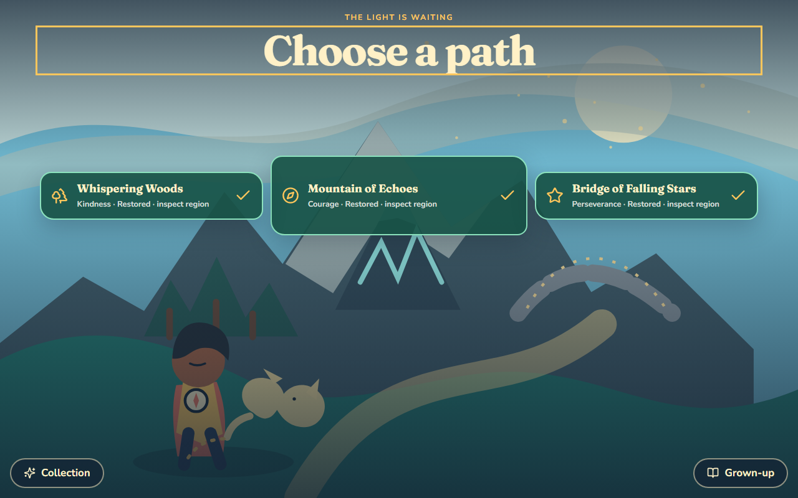

# Kai's Adventure

**A visual-first storybook game where children help Kai and his silent light-fox Pip restore a fading world by practising Courage, Kindness, and Perseverance in real life.**

Abstract values are hard to feel. Kai's Adventure gives one small real-world action an immediate, legible consequence: the story world changes, a region returns to life, and the child keeps a named treasure.



## Demo

The complete product builds and runs locally. The public Vercel URL is pending repository-owner authentication and project connection; no deployment URL is claimed until it is smoke-tested.

For a clean judge run, open `/reset`, confirm, then begin at `/`. The scripted 100–130 second recording path is in [docs/DEMO_SCRIPT.md](docs/DEMO_SCRIPT.md), and honest readiness/blocker status is in [docs/JUDGING_STATUS.md](docs/JUDGING_STATUS.md).

## What is built

- A complete Courage showcase: opening → grown-up setup → map → two expressive choices → real-world mission → persisted return → six-beat restoration → Courage Compass → collection/reflection/reset.
- Complete shorter Kindness and Perseverance journeys with distinct transformations, rewards, and prompts.
- Courage-first map progression: two visibly sleeping regions unlock together after the Mountain is restored.
- Quick Quest and Three-Day framing over the same content graph, with no time gate.
- Original layered SVG artwork for Kai, Pip, the three-region world, camp, compass, crystals, paths, and restoration effects.
- Versioned local persistence, deterministic quest selection, explicit migration, corrupt-data backup/recovery, idempotent rewards, and reset limited to `heart-hero:kai-adventure:*` keys.
- Keyboard/touch operation, visible focus, 44×44 px minimum targets, WCAG AA-oriented tokens, non-color state labels, polite announcements, reduced motion, and responsive 375/768/1280 layouts.

## Run locally

Node.js 22 and npm 11 were used for the verified build.

```bash
npm ci
npm run dev
```

Open the local URL printed by Vite. Production verification:

```bash
npm run typecheck
npm run lint
npm run test
npm run build
npm run test:e2e
```

Playwright requires Chromium once per machine: `npx playwright install chromium`.

## Architecture

The standalone shell is Vite 5 + React 18 + strict TypeScript 5 + Tailwind 3 + React Router 6. Quest packs live in structured TypeScript outside components and are validated with Zod. Progression is a pure reducer; selection is deterministic by region, challenge match, priority, then quest ID.

The portable feature exports `KaiAdventureRoutes` plus stable `StorageAdapter`, `QuestSource`, and `VirtueLexicon` boundaries. A configurable base path supports future mounting without changing engine logic. Adventure screens lazy-load as a separate production chunk.

There is **no OpenAI SDK/API, runtime AI, Supabase, backend function, authentication, external database, environment variable, API key, secret, analytics, or runtime image generation**.

Full design details: [technical architecture](docs/TECHNICAL_ARCHITECTURE.md) and [Heart Hero integration plan](docs/HEART_HERO_INTEGRATION_PLAN.md).

## Deployment

Vercel configuration is committed for a static Vite SPA:

- install: `npm ci`;
- build: `npm run build`;
- output: `dist`;
- deep routes: `vercel.json` rewrites all requests to `index.html`;
- environment variables: none.

Local production-like refresh checks pass for all public routes. The final owner action is to import the GitHub repository into Vercel, deploy `main`, and add the verified URL here.

## Testing and accessibility

Vitest covers pack validation, deterministic selection, reducer idempotence, known migration, malformed/future storage recovery, and scoped reset. Playwright covers:

- the complete Courage journey with reload after mission acceptance;
- all three restored regions and all three rewards;
- axe scans on every major screen;
- ten public-route direct refreshes;
- keyboard-only setup and heading focus;
- minimum control dimensions;
- immediate reduced-motion restoration;
- 375, 768, and 1280 px responsive layouts and screenshots.

The current gate is 5 unit/component tests and 5 browser tests, all passing. See [BUILD_LOG.md](BUILD_LOG.md) for phase-by-phase results and defects corrected along the way.

## Evidence

Judge-facing screenshots live in [docs/evidence](docs/evidence). The planning package, evidence plan, demo script, and judging status are all in [docs](docs).

## Build Week provenance

Kai's Adventure was created as a new standalone Education project during OpenAI Build Week. The target repository was empty before the planning commit. Rafa set the vision, audience, Kai/Pip identities, virtues, regions, real-world mission model, zero-runtime-AI architecture, scope priorities, and delivery gates.

Codex inspected the compatibility reference, produced the approved planning package, then implemented the original code, SVGs, quest content, tests, debugging, documentation, and evidence under Rafa's direction. GPT-5.6 was used through Codex for development reasoning and execution. **GPT-5.6 and Codex are development tools, not deployed runtime dependencies.**

## Relationship to Heart Hero

The pre-existing [`heart-hero-quest`](https://github.com/RafaTahir/heart-hero-quest) product was inspected read-only at commit `9d850349ef230ae51cc0a3e023196f0bf45772a7` as a technology/integration reference. It is not an earlier version of Kai's Adventure, and its assets, auth/Supabase coupling, runtime generation, global shell, and terminology were not copied.

Future integration mounts this feature under `src/features/kai-adventure`, adopts the parent shell's shared primitives, injects account persistence and an alternate lexicon, and retains scoped `--kai-*` scene tokens. Quest IDs and reducer logic do not change.

## Assets and licenses

All central scene artwork is original repository-owned SVG/CSS created for this project. Fraunces and Nunito are bundled locally through Fontsource; both are open-license fonts. Lucide supplies interface icons under its ISC license. Dependency license details remain available in the npm lockfile and upstream packages.

## MVP cuts and roadmap

Deliberate cuts include decorative parallax, ambient particle density, narration, scoring, accounts, cloud sync, avatar customization, more regions, and bespoke copy for every age/choice combination. The complete core loop, visible restoration, persistence/reset, all three regions, mobile usability, and accessibility baseline were not cut.

After the hackathon, the injected boundaries can support parent-product account persistence, localization/alternate virtue labels, optional narration, and additional validated static quest packs.
